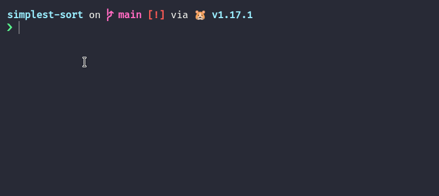

# Simplest sort

Showcases the simplest sorting algorithm that works in quadratic time. From [here](https://arxiv.org/pdf/2110.01111.pdf).

The pseudocode for this algo can be seen below (sorts an array with n elements in non decreasing order):

```
for i from 0 to n:
    for j from 0 to n:
        if Ar[i] < Ar[j]:
            swap(Ar[i], Ar[j])
```

This repository houses a go program that uses exactly this algo, but animates how it works on your terminal! Demo below:



## Usage

Assuming you have `git` and `go` installed, you can simply clone and run.

```sh
git clone https://github.com/radiantly/simplest-sort

go run main.go
```

Should work on any modern Linux terminal. Untested on MacOS and Windows.

## License

MIT
